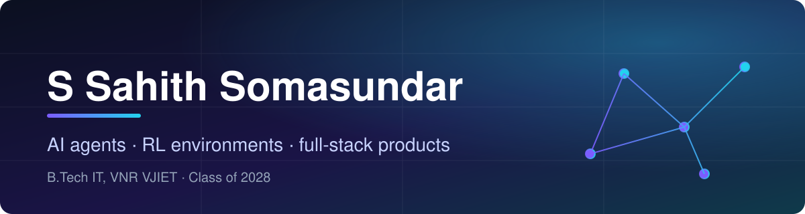

  

  I build agentic AI systems and the FastAPI / React products around them: 
  LLM agents, RAG pipelines and RL environments.

  

## 🚀 Best work

| Project | What it does | Built with |
|---|---|---|
| **[ScamShield AI](https://github.com/sahithsundarw/Scamshield-AI)** | Agentic honeypot that engages scammers and extracts UPI IDs, bank accounts and phishing links. 229 offline tests, live demo. | FastAPI · GPT-4o · MongoDB · React |
| **[Sentinel](https://github.com/sahithsundarw/sentinel)** | RL environment that trains content-safety moderators against an adaptive adversary, with GRPO/REINFORCE and a Q-learning baseline. Results reported with caveats. | Python · Llama-3.1-8B · TRL · FastAPI |
| **[Semiconductor image restoration](https://github.com/sahithsundarw/bunker_backer)** | 1.39M-parameter NAFSR network: 29.59 dB PSNR on held-out data, beats a U-Net baseline. README documents failed experiments. | PyTorch · LPIPS |
| **[Atlas](https://github.com/sahithsundarw/Atlas)** | Travel assistant on LangGraph with RAG, parallel tool calls, guardrails and a 25-case eval harness. | LangGraph · ChromaDB · FastAPI · React |

## 🧰 Stack

## 📫 Reach me

[sahith-builds.netlify.app](https://sahith-builds.netlify.app)

[sahithsundarw@gmail.com](mailto:sahithsundarw@gmail.com)
